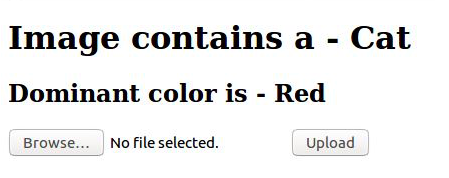

# Dog or Cat - A Simple Computer Vision Flask API
A simple Flask API that classifies dog/cat and and finds the dominant color in a picture.

# Getting Started

This instructions will get you a copy of the project up and running on your local machine for development and testing purposes. 

## Prerequisites

In this project we'll be using the RESTful API protocol which allows us to run our Computer Vision app via the web. 

We need Flask installed for this project. You can install Flask using command lines:

```
pip install flask
```
If you use Anaconda as the package management:
```
conda install flask
```

## Running the Project

Ensure that you are in the project home directory. Run ```app.py``` using the below command to start the Flask API:

```
python app.py
```

By default, Flask will run on port 5000. Navigate to URL:

```
http://127.0.0.1:5000
```

You should be able to view the homepage as below:


Choose an image from your computer and hit Upload. You should be able to see the result page below:



# License

This project is licensed under the MIT License - see the [LICENSE.md](https://github.com/andreduong/dog-vs-cat-flask-api/blob/master/LICENSE.md) file for details.
